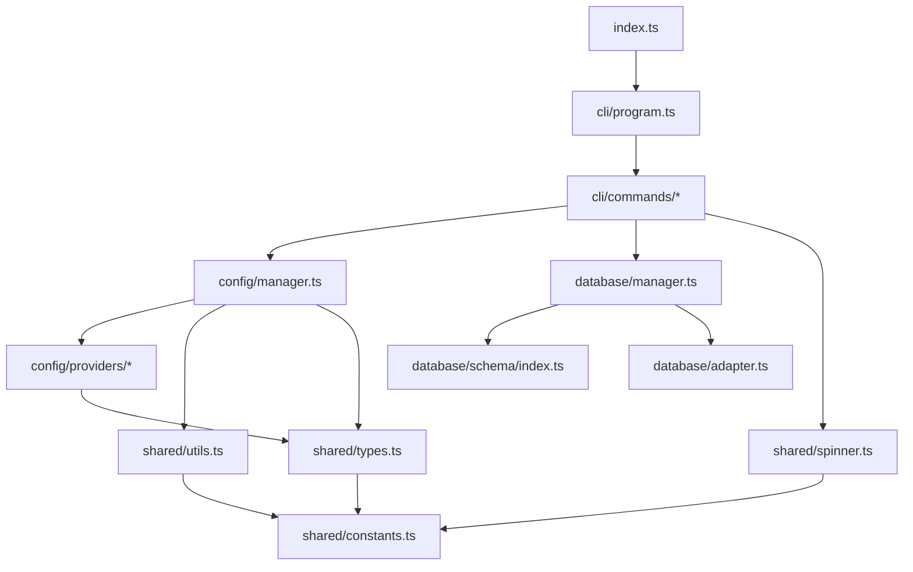
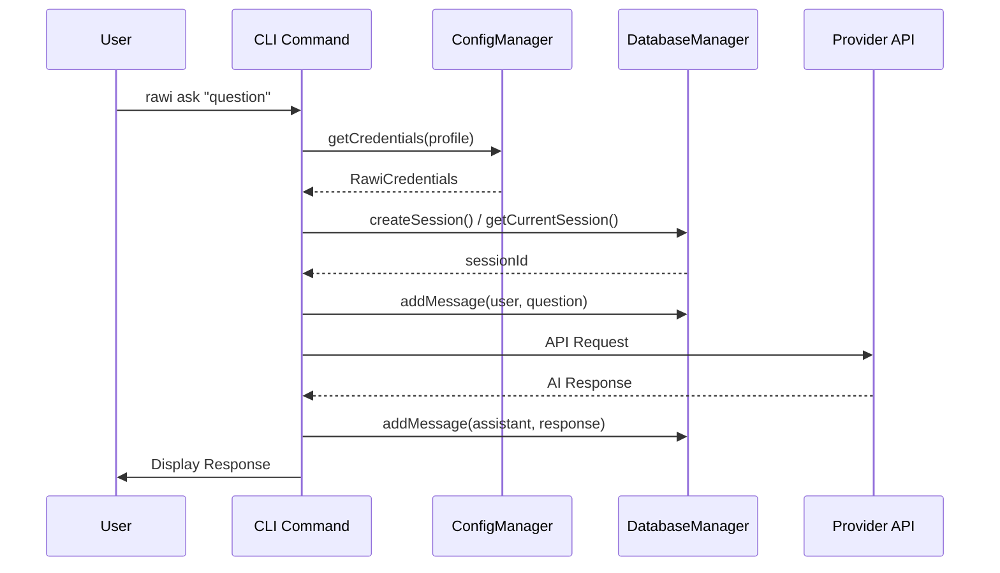
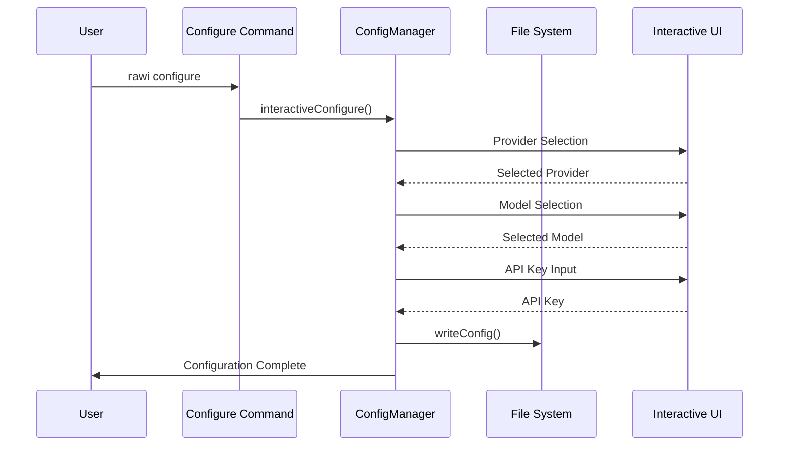
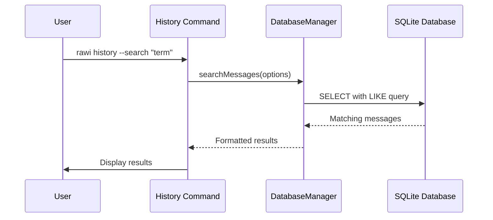

# Architecture Guide

Comprehensive overview of Rawi's architecture, design decisions, and code organization.

## 🏗️ High-Level Architecture

```
┌─────────────────────────────────────────────────────────────┐
│                     CLI Interface                           │
│  ┌─────────────┬─────────────┬─────────────┬─────────────┐  │
│  │    ask      │ configure   │  history    │    info     │  │
│  └─────────────┴─────────────┴─────────────┴─────────────┘  │
└─────────────────────────────────────────────────────────────┘
                              │
┌─────────────────────────────────────────────────────────────┐
│                 Core Application Layer                      │
│  ┌─────────────┬─────────────┬─────────────┬─────────────┐  │
│  │   Config    │  Database   │  Providers  │   Shared    │  │
│  │  Manager    │  Manager    │   System    │ Utilities   │  │
│  └─────────────┴─────────────┴─────────────┴─────────────┘  │
└─────────────────────────────────────────────────────────────┘
                              │
┌─────────────────────────────────────────────────────────────┐
│                External Integrations                        │
│  ┌─────────┬─────────┬─────────┬─────────┬─────────────────┐ │
│  │ OpenAI  │Anthropic│ Google  │  xAI    │   Local DB      │ │
│  │   API   │   API   │   API   │  API    │   (SQLite)      │ │
│  │         │         │         │         │                 │ │
│  │ Azure   │Bedrock  │  Qwen   │ Ollama  │   File System   │ │
│  │OpenAI   │   API   │   API   │  Local  │ (Config/Logs)   │ │
│  └─────────┴─────────┴─────────┴─────────┴─────────────────┘ │
└─────────────────────────────────────────────────────────────┘
```

## 📁 Project Structure

```
src/
├── cli/                    # Command-line interface
│   ├── commands/           # Individual CLI commands
│   │   ├── ask.command.ts
│   │   ├── configure.command.ts
│   │   ├── history.command.ts
│   │   ├── info.command.ts
│   │   └── index.ts
│   ├── index.ts
│   └── program.ts          # Main CLI program setup
├── config/                 # Configuration management
│   ├── providers/          # AI provider configurations
│   │   ├── amazon-bedrock.provider.ts
│   │   ├── anthropic.provider.ts
│   │   ├── azura.provider.ts
│   │   ├── google.provider.ts
│   │   ├── index.ts
│   │   ├── ollama.provider.ts
│   │   ├── openai.provider.ts
│   │   ├── qwen.provider.ts
│   │   └── xai.provider.ts
│   ├── index.ts
│   ├── manager.ts          # Configuration file management
│   └── utils.ts            # Configuration utilities
├── data/                   # Static data and prompts
│   └── prompts.ts
├── database/               # Chat history and session management
│   ├── config/
│   │   └── paths.ts
│   ├── schema/
│   │   └── index.ts        # Database schema definitions
│   ├── adapter.ts          # Database adapter interface
│   ├── index.ts
│   └── manager.ts          # Database operations
├── shared/                 # Shared utilities and types
│   ├── constants.ts        # Application constants
│   ├── index.ts
│   ├── spinner.ts          # Loading indicators
│   ├── types.ts            # TypeScript type definitions
│   └── utils.ts            # Utility functions
└── index.ts                # Main entry point
```

## 🧩 Module Dependencies



## 🔧 Core Components

### 1. CLI Layer (`src/cli/`)

The CLI layer handles user interaction and command parsing.

#### Program Setup (`program.ts`)

- Creates the main CLI program using Commander.js
- Handles global options and version information
- Registers all available commands
- Manages error handling and exit codes

#### Command Structure

Each command follows a consistent pattern:

```typescript
export const createCommandName = (): Command => {
  const command = new Command("command-name");

  return command
    .description("Command description")
    .option("--option", "Option description")
    .action(async (options) => {
      // Command implementation
    });
};
```

#### Command Responsibilities

- **ask**: Query AI providers and manage conversations
- **configure**: Manage provider configurations and profiles
- **history**: View and manage chat history
- **info**: Display system and configuration information

### 2. Configuration Layer (`src/config/`)

Manages provider configurations and user profiles.

#### ConfigManager (`manager.ts`)

- **File Operations**: Read/write configuration files
- **Profile Management**: Create, update, delete profiles
- **Interactive Setup**: Guided configuration wizard
- **Validation**: Ensure configuration completeness

#### Provider System (`providers/`)

Each provider exports a standardized configuration:

```typescript
export const providerName: ProviderConfig = {
  name: "provider-id",
  displayName: "Human Readable Name",
  models: [
    {
      name: "model-id",
      displayName: "Model Display Name",
      description: "Model description",
    },
  ],
};
```

#### Configuration Storage

- **Location**: `~/.rawi/credentials`
- **Format**: JSON with encrypted sensitive data
- **Structure**: Profile-based organization
- **Security**: File permissions restricted to owner

### 3. Database Layer (`src/database/`)

Manages persistent chat history and session data.

#### DatabaseManager (`manager.ts`)

- **Session Management**: Create, retrieve, delete sessions
- **Message Storage**: Store user and AI responses
- **Search Functionality**: Full-text search across messages
- **Statistics**: Usage analytics and reporting
- **Cleanup**: Remove old sessions and messages

#### Schema Design (`schema/index.ts`)

```typescript
// Sessions table
interface ChatSession {
  id: string; // UUID primary key
  profile: string; // Profile name
  title?: string; // Optional session title
  createdAt: string; // ISO timestamp
  updatedAt: string; // ISO timestamp
  messageCount: number; // Cached message count
}

// Messages table
interface ChatMessage {
  id: string; // UUID primary key
  sessionId: string; // Foreign key to sessions
  role: "user" | "assistant"; // Message type
  content: string; // Message content
  timestamp: string; // ISO timestamp
  provider: SupportedProvider; // AI provider used
  model: string; // Model used
  temperature?: number; // Temperature setting
  maxTokens?: number; // Token limit
  metadata?: string; // JSON metadata
}
```

#### Database Adapter (`adapter.ts`)

- **SQLite**: Local database for chat history
- **Connection Management**: Pool connections efficiently
- **Migration Support**: Schema version management
- **Error Handling**: Graceful failure recovery

### 4. Shared Layer (`src/shared/`)

Common utilities and type definitions used across modules.

#### Type System (`types.ts`)

- **Provider Types**: Union types for providers and models
- **Configuration Types**: Interfaces for all config structures
- **Database Types**: Chat and session interfaces
- **Option Types**: Command-line option definitions

#### Constants (`constants.ts`)

- **Application Constants**: App name, directories, files
- **Default Values**: Temperature, tokens, limits
- **Display Names**: User-friendly provider names
- **Validation Limits**: Min/max values for inputs

#### Utilities (`utils.ts`)

- **File System**: Config directory and file operations
- **Validation**: Input validation functions
- **Formatting**: Display formatting utilities
- **Security**: API key masking and encryption

#### Spinner Management (`spinner.ts`)

- **Loading Indicators**: Progress feedback for async operations
- **Multiple Spinners**: Concurrent operation tracking
- **Status Management**: Success/failure indicators
- **Clean Exit**: Proper cleanup on interruption

## 🔄 Data Flow

### 1. Command Execution Flow



### 2. Configuration Flow



### 3. History Management Flow



## 🎯 Design Patterns

### 1. Command Pattern

Each CLI command is implemented as a separate module that creates a Commander.js command object. This allows for:

- **Modularity**: Easy addition of new commands
- **Testability**: Individual command testing
- **Reusability**: Commands can be composed or extended

### 2. Strategy Pattern

AI providers are implemented as separate modules with a common interface:

```typescript
interface ProviderConfig {
  name: string;
  displayName: string;
  models: ModelInfo[];
}
```

This enables:

- **Extensibility**: New providers without core changes
- **Flexibility**: Runtime provider switching
- **Maintainability**: Provider-specific logic isolation

### 3. Factory Pattern

The provider system uses a factory pattern to create provider configurations:

```typescript
export const getProvider = (name: SupportedProvider): ProviderConfig => {
  return providers[name];
};
```

### 4. Repository Pattern

The DatabaseManager acts as a repository for chat data:

```typescript
class DatabaseManager {
  // Abstract database operations
  async getSessions(options: ChatHistoryOptions): Promise<ChatSession[]>;
  async addMessage(/* params */): Promise<void>;
  // ...
}
```

### 5. Singleton Pattern

The ConfigManager and spinner system use singleton-like patterns to ensure consistent state.

## 🔐 Security Architecture

### 1. Credential Storage

- **Encryption**: Sensitive data encrypted at rest
- **File Permissions**: Config files restricted to owner (600)
- **Memory Protection**: Credentials cleared after use
- **No Logging**: API keys never logged or displayed

### 2. Input Validation

- **Sanitization**: All user inputs validated and sanitized
- **Type Safety**: TypeScript provides compile-time type checking
- **Range Validation**: Numeric inputs validated against limits
- **Format Validation**: API keys validated for correct format

### 3. Network Security

- **TLS**: All API communications use HTTPS
- **Timeout Handling**: Network requests have appropriate timeouts
- **Error Handling**: Network errors handled gracefully
- **Retry Logic**: Automatic retry for transient failures

### 4. Local Data Protection

- **Database Encryption**: SQLite database can be encrypted
- **Temporary Files**: No sensitive data in temporary files
- **Process Isolation**: Each command runs in isolation
- **Clean Shutdown**: Proper cleanup on exit

## 🚀 Performance Considerations

### 1. Lazy Loading

- **Provider Loading**: Providers loaded only when needed
- **Database Connection**: Connections created on demand
- **Configuration Reading**: Config read only when accessed

### 2. Caching Strategy

- **Configuration Cache**: In-memory caching of frequent config reads
- **Session Cache**: Current session cached for quick access
- **Provider Cache**: Provider configs cached after first load

### 3. Database Optimization

- **Indexing**: Appropriate indexes on search columns
- **Connection Pooling**: Efficient connection management
- **Query Optimization**: Optimized queries for history search
- **Cleanup Jobs**: Background cleanup of old data

### 4. Memory Management

- **Streaming**: Large responses handled with streams
- **Garbage Collection**: Explicit cleanup of large objects
- **Memory Limits**: Configurable memory limits for operations

## 🧪 Testing Architecture

### 1. Test Structure

```
tests/
├── unit/                   # Unit tests
│   ├── config/
│   ├── database/
│   └── shared/
├── integration/            # Integration tests
│   ├── cli/
│   └── providers/
├── e2e/                    # End-to-end tests
└── fixtures/               # Test data
```

### 2. Testing Strategies

- **Unit Tests**: Individual function and class testing
- **Integration Tests**: Component interaction testing
- **E2E Tests**: Full workflow testing
- **Mock Providers**: Test providers for reliable testing

### 3. Test Utilities

- **Mock Data**: Realistic test data generation
- **Test Helpers**: Common testing utilities
- **Fixtures**: Predefined test scenarios
- **Assertions**: Custom assertion helpers

## 🔮 Extension Points

### 1. Adding New Providers

1. Create provider configuration in `src/config/providers/`
2. Add provider to `SupportedProvider` type
3. Update provider registry in `providers/index.ts`
4. Add provider-specific settings type
5. Update configuration command logic

### 2. Adding New Commands

1. Create command file in `src/cli/commands/`
2. Implement command creation function
3. Add command to program in `cli/program.ts`
4. Update exports in `cli/commands/index.ts`

### 3. Extending Database Schema

1. Update types in `src/shared/types.ts`
2. Add migration in `src/database/schema/`
3. Update DatabaseManager methods
4. Test with existing data

### 4. Adding New Output Formats

1. Create formatter in `src/shared/formatters/`
2. Add format option to relevant commands
3. Update command logic to use formatter
4. Add tests for new format

## 🔄 Future Architecture Considerations

### 1. Plugin System

- **Dynamic Loading**: Runtime plugin loading
- **Plugin API**: Standardized plugin interface
- **Registry**: Plugin discovery and management
- **Sandboxing**: Safe plugin execution

### 2. Microservice Architecture

- **Service Separation**: Separate config, database, and provider services
- **API Gateway**: Central API management
- **Load Balancing**: Distribute provider requests
- **Service Discovery**: Dynamic service location

### 3. Cloud Integration

- **Remote Config**: Cloud-based configuration storage
- **Distributed Database**: Multi-region chat history
- **Edge Caching**: Global content distribution
- **Serverless Functions**: On-demand processing

### 4. Real-time Features

- **WebSocket Support**: Real-time communication
- **Streaming Responses**: Live response streaming
- **Collaborative Sessions**: Multi-user conversations
- **Event Sourcing**: Complete audit trail

This architecture provides a solid foundation for current functionality while allowing for future growth and enhancement.
